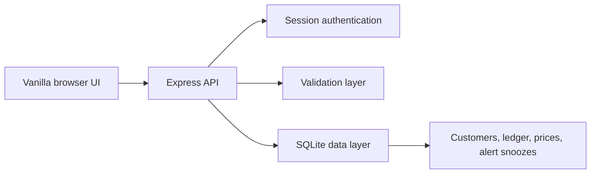

# Butcher Debt Manager

A full-stack customer debt ledger built for the daily workflow of a small
butcher shop.

The application records purchases and payments, calculates each customer's
balance, and highlights debts that may require follow-up. It uses a lightweight
vanilla JavaScript frontend, an Express API, and a local SQLite database.

## Problem

Customer purchases and partial payments were difficult to track reliably on
paper. The shop needed a fast ledger that could answer three questions:

- How much does each customer owe?
- When did the debt begin?
- Which debts need attention now?

## Features

- Create, edit, archive, and search customers
- Record purchases, quantities, prices, extras, and notes
- Record partial or complete payments
- Calculate balances from an immutable-style ledger
- Edit ledger entries while preventing unsafe deletion
- Track total outstanding shop debt
- Flag high, old, or inactive debt
- Snooze follow-up alerts
- Maintain reusable product prices
- Support Arabic and Hebrew customer information
- Protect operational pages with session authentication

## Technology

- Node.js 20+
- Express
- SQLite through `better-sqlite3`
- Server-side sessions
- Helmet security headers
- Login rate limiting
- Vanilla HTML, CSS, and JavaScript
- Node's built-in test runner

## Architecture



See [Architecture](docs/ARCHITECTURE.md) and
[API reference](docs/API.md) for more detail.

## Project structure

```text
public/                 Browser interface
server/
  auth.js               Credential verification
  config.js             Environment configuration
  db.js                 SQLite schema and queries
  middleware.js         Authentication middleware
  server.js             Express routes and startup
  validation.js         Reusable input validation
  test/                 Unit and database tests
docs/
  API.md                Endpoint reference
  ARCHITECTURE.md       Design decisions and limitations
```

## Run locally

### Requirements

- Node.js 20 or newer
- npm

### Setup

```bash
git clone https://github.com/rayanib/butcher-debt-manager-fullstack.git
cd butcher-debt-manager-fullstack/server
npm install
```

Copy `.env.example` to `.env` in the repository root and set strong values:

```env
ADMIN_USER=shop-admin
ADMIN_PASS=replace-with-a-strong-password
SESSION_SECRET=replace-with-a-long-random-secret
PORT=3000
```

Start the application:

```bash
npm start
```

Open `http://localhost:3000/login.html`.

The SQLite database is created at `server/data/butcher.db` unless `DB_PATH` is
configured.

## Tests

```bash
cd server
npm test
```

The tests cover authentication decisions, production configuration, request
validation, and purchase/payment balance calculations.

## Security

- Production startup fails when `SESSION_SECRET` is missing.
- Authentication comparisons use a timing-safe comparison.
- Login attempts are rate-limited.
- Session cookies are HTTP-only, same-site, and secure in production.
- SQL values use parameterized statements.
- Request bodies are size-limited and validated.

The current single-admin credentials are environment-based. A future multi-user
version should store password hashes and roles in the database. The default
in-memory session store is suitable for local/single-process use, not a
horizontally scaled deployment.

Read [SECURITY.md](SECURITY.md) before deploying publicly.

## Current limitations

- Designed for one shop and one server process
- No multi-user roles or audit identities
- No automated browser tests
- No external backup scheduler
- Inline frontend scripts prevent a strict Content Security Policy
- SQLite is appropriate for this deployment size but not horizontal scaling

## Roadmap

- Extract route modules and service classes as the API grows
- Add database migrations and backup/restore commands
- Move inline scripts into JavaScript modules and enable strict CSP
- Add hashed multi-user accounts and role-based access
- Add integration and browser-level tests

## Author

Rayan Ibrahem — Computer Science graduate and full-stack developer
[GitHub](https://github.com/rayanib)
